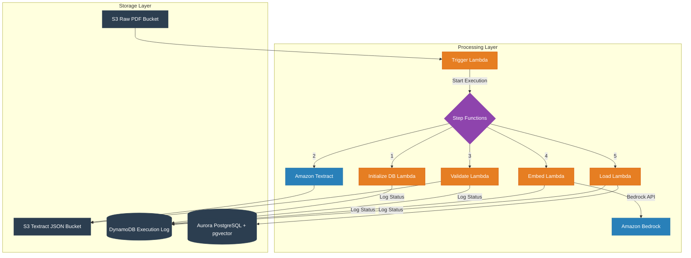

# Architecture Diagram

The above diagram shows the complete RAG (Retrieval-Augmented Generation) pipeline architecture. Here's a detailed breakdown:

## Storage Layer
- **S3 Buckets**: 
  - Raw PDF bucket for document ingestion
  - Textract JSON bucket for extracted text storage
- **DynamoDB**: Execution logging and status tracking
- **Aurora PostgreSQL**: Vector storage with pgvector extension

## Processing Layer
1. **Document Upload Flow**:
   - PDF uploaded to S3 Raw bucket
   - Triggers Lambda function
   - Lambda starts Step Functions execution

2. **Step Functions Workflow**:
   - Initialize database (if needed)
   - Extract text using Textract
   - Validate extraction results
   - Generate embeddings via Bedrock
   - Load vectors into Aurora

3. **Monitoring and Logging**:
   - All Lambda functions log to DynamoDB
   - Status tracking throughout pipeline
   - Error handling at each step

## Key Features
- Serverless architecture
- Event-driven processing
- Scalable vector storage
- Comprehensive logging
- Error handling and retry mechanisms 